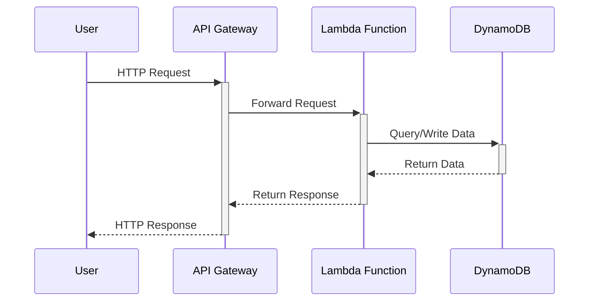

### System Diagram



## Services used:
1. [AWS API Gateway](https://aws.amazon.com/api-gateway/)
2. [AWS Lambda](https://aws.amazon.com/lambda/)
3. [AWS DynamoDB](https://aws.amazon.com/dynamodb/)
4. [AWS CloudWatch](https://aws.amazon.com/cloudwatch/)
5. [AWS CloudFormation](https://aws.amazon.com/cloudformation/)
6. [AWS IAM](https://aws.amazon.com/iam/)
7. [AWS S3](https://aws.amazon.com/s3/)

## Project explanation:
O projeto foi desenvolvido com Python no backend e ReactJS no frontend, em ambos foi utilizado o framework [serverless](https://www.serverless.com), tentei utilizar o Localstack mas devido a minha falta de familiaridade com a ferramenta encontrei algumas barreiras e precisaria de mais tempo para entender melhor como ela funciona, utilizei o design pattern clean architecture no backend e o padrão de componentes do ReactJS no frontend, o projeto conta com testes unitarios tando no backend quanto no frontend, para o backend utilizei o [unittest](https://docs.python.org/3/library/unittest.html) e para o frontend utilizei o [jest](https://jestjs.io/).

Sobre o item 1 dos requisitos do projeto optei por fazer a feature de geração de senhas no frontend por algumas razões:
1. Não ha implicações de segurança, pois a senha é criptografada no backend.
2. Redução de custo com o backend.
3. Experiência do usuário.

As validações do projeto são redundantes, pois o frontend e o backend fazem as validações, isso foi feito para garantir que o usuário não consiga enviar uma requisição inválida.

A url de acesso a senha é gerada com o id da senha no formato uuid4, pensei em inserir uma autenticação simples para desbloquear o acesso a senha ampliando o escopo do projeto, mas me pareceu desnecessário, pois a url já é única e não é possível acessar a senha sem ela.

O sistema utiliza o recurso do dynamodb de TTL para expirar as senhas, mas para garantir que a senha será excluída é verificado a regra de negocio a cada requisição de acesso a senha, e caso a senha esteja expirada ou o limite de visualizações tenha sido atingido a senha é excluída.

O sistema utiliza a biblioteca padrão do python de logging, para facilitar a auditoria e visualização dos logs no cloudwatch, mas poderia ser utilizado o [loguru](https://github.com/Delgan/loguru), [structlog](https://www.structlog.org/en/stable/) etc.

Por fim, foi um projeto bem interessante, nunca tinha utilizado o framework serverless e o dynamodb, foi uma boa oportunidade para aprender mais sobre essas ferramentas, espero que gostem do resultado ❤️

## Requirements
1. [Node.js](https://nodejs.org/en/download/)
2. [Python](https://www.python.org/downloads/)
3. [Serverless](https://www.serverless.com/framework/docs/getting-started/)

## Installation

> local:

1. install python requirements
    ```sh
    cd backend && python3 -m venv .venv && source .venv/bin/activate && pip3 install -r requirements.txt
    ```

2. install node dependencies
    ```sh
    cd frontend && npm install # install frontend dependencies
    cd backend && npm install # install serverless offline
    ``` 

3. start project with serverless offline
    ```sh
    # create dynamodb table
    sls dynamodb install && sls dynamodb start

    # start serverless offline
    python3 start_local.py
    ```

### Backend API
    
> GET
```sh
http://localhost:4000/password/{id}
```

> POST
```sh
endpoint: http://localhost:4000/password
body: {
    "password": "I23@4b(D", # the password - string
    "view_limit": 3, # the number of max views - integer
    "valid_until": 2 # the number of days that the password will be valid - integer
}
```


