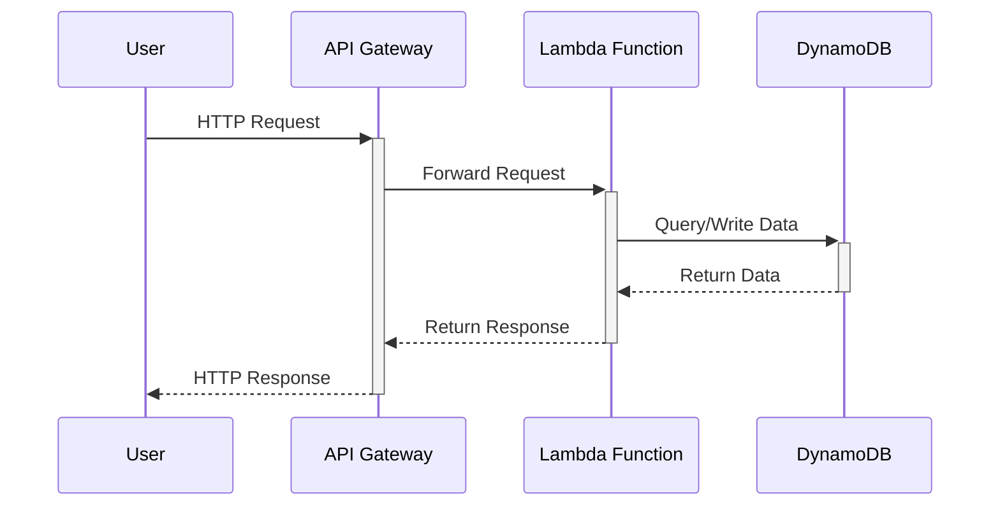

### System Diagram



## Installation

> local:

1. install python requirements
    ```sh
    cd backend && python3 -m venv .venv && source .venv/bin/activate && pip3 install -r requirements.txt
    ```

2. install node dependencies
    ```sh
    cd frontend && npm install
    cd backend && npm install
    ``` 

3. start project with serverless offline
    ```sh
    docker compose up -d && python3 start_local.py
    ```

### Backend API
    
> GET
```sh
http://localhost:4000/password/{id}
```

> POST
```sh
endpoint: http://localhost:4000/password
body: {
    "password": "123",
    "view_limit": 3,
    "valid_until": 2
}
```


