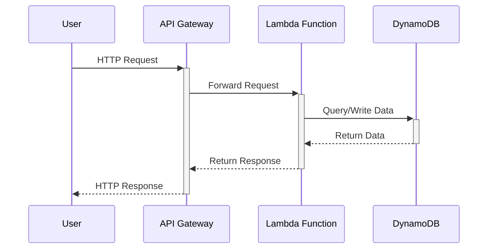

### System Diagram



> cryptography error solved
```sh 
pip install \
  --platform manylinux2014_x86_64 \
  --implementation cp \
  --python 3.9 \
  --only-binary=:all: --upgrade \
  --target=build/package \
  cryptography==38.0.3
```
### Create lambda package

```sh
python scripts/zip.py
```

### Create lambda function

```sh
awslocal lambda create-function \
    --function-name pass-generate-security \
    --runtime python3.9 \
    --zip-file fileb:///var/lib/localstack/deployment-package.zip \
    --handler main.lambda_handler \
    --role arn:aws:iam::000000000000:role/lambda-role

# update lambda function
awslocal lambda update-function-code \
    --function-name pass-generate-security \
    --zip-file fileb:///var/lib/localstack/deployment-package.zip
```

### Create api gateway

```sh
awslocal apigateway create-rest-api --region us-east-1 --name 'API pass-gen'

awslocal apigateway get-resources --region us-east-1 --rest-api-id <rest-api-id>

awslocal apigateway create-resource \
--region us-east-1 \
--rest-api-id <rest-api-id> \
--parent-id <resource-id> \
--path-part "password"

awslocal apigateway create-resource \
--region us-east-1 \
--rest-api-id <rest-api-id> \
--parent-id <password-endpoint-id> \
--path-part "{id}"

awslocal apigateway put-method \
--region us-east-1 \
--rest-api-id <rest-api-id> \
--resource-id <{id}-endpoint-id> \
--http-method ANY \
--request-parameters "method.request.path.id=true" \
--authorization-type "NONE"

awslocal apigateway put-integration \
--region us-east-1 \
--rest-api-id <rest-api-id> \
--resource-id <{id}-endpoint-id> \
--http-method ANY \
--type AWS_PROXY \
--integration-http-method POST \
--uri arn:aws:apigateway:us-east-1:lambda:path/2015-03-31/functions/arn:aws:lambda:us-east-1:000000000000:function:pass-generate-security/invocations \
--passthrough-behavior WHEN_NO_MATCH

awslocal apigateway create-deployment \
--region us-east-1 \
--rest-api-id <rest-api-id> \
--stage-name pass-gen
```

### API endpoints
    
> POST | GET | DELETE
```sh
http://localhost:4566/restapis/n1ifgemi7c/pass-gen/_user_request_/password/{id}
```


