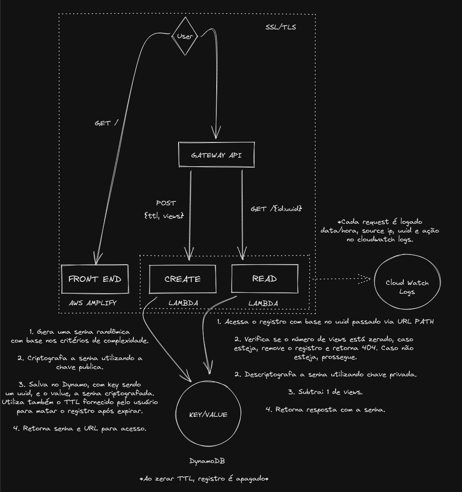

# Avaliação de conhecimentos em Desenvolvimento de Software

## Arquitetura

- Conexões de rede protegidas via SSL/TLS.
- Criptografa a senha utilizando chave RSA pública para salvar de forma segura no banco de dados.
- o TTL fornecido pelo cliente, é usado para expirar o registro no banco sem exigir responsabilidade da aplicação.
- Utiliza uuid como parâmetro de URL afim de evitar força bruta para adivinhar outras senhas.
- O valor máximo de visualizações, será salvo no value do registro no Dynamo, junto com a senha criptografada e a cada visualização, o valor será decrementado.
- A senha será gerada no backend, devido a ser um contexto de memória controlado, evitando que ações maliciosas por terceiros interfiram no computador do usuário.
- Arquivo de configuração yml, terá informações como políticas de complexidades e diretório contendo as chaves RSA.

## ToDo

- Avaliar a melhor maneira de salvar os views.

## Explanação

Ao receber uma requisição no /, o Amplify enviará o frontend que por sua vez, terá os controles necessários, como número máximo de visualizações (views) e o tempo máximo de vida (TTL).

Ao submeter esse formulário, um POST será enviado para o Gateway API que por sua vez, realizará uma chamada à Lamda Create, que será responsável por gerar uma senha randômica, um uuid, criptografar a senha, salvar os dados no Dynamo e retornar um json contendo o link e a senha para o usuário.

Ao abrir o link, um GET será enviado contendo na URL, um parâmetro com o UUID, o Gateway API após receber essa requisição, passará para a Lambda Read, que por sua vez, irá recuperar o registro com o UUID vindo pela URL, checará se a quantidade de views está zerando e se necessário, removerá e retornará 404. Se a view não estiver zerando, o mesmo será decrementado, a senha será descriptografada com a chave privada e será retornada na requisição para que o Frontend renderize-a.

