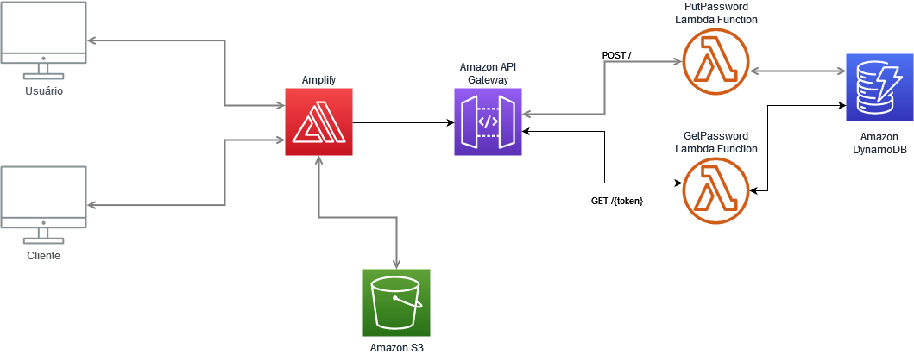

# Avaliação de conhecimentos em Desenvolvimento de Software

## Considere a seguinte necessidade:
 
Precisamos enviar uma senha de maneira segura para um cliente. Para isso, ao invés de encaminhá-la via E-mail, SMS, Slack, etc, foi dado como solução o desenvolvimento de um sistema com as seguintes funções:
 
1- Usuário irá inserir uma <strong>senha</strong> ou solicitar ao Sistema para gerar <strong>senha aleatória</strong> baseada em <strong>políticas de complexidade</strong> (tipo de caracteres, números, letras, tamanho, etc); 
- **Exemplo1**: o usuário digita sua senha no campo de texto;
- **Exemplo2**: o usuário seleciona os parametros de complexidade de senha e ao clicar no botão "Gerar Senha" irá obter uma senha aleatória;

2- Usuário irá especificar <strong>quantas vezes</strong> a senha gerada poderá ser vista e <strong>qual o tempo</strong> que a senha ficará válida;
- **Exemplo**: o usuário irá especificar que a senha possa ser vista apenas <em>duas vezes</em> pelo prazo de <em>um dia</em>;

3- O sistema irá <strong>gerar uma URL</strong> que dá acesso a visualização da senha, baseando-se nos critérios do item 02;
- **Exemplo**: o usuário enviará a URL para que o cliente possa visualizar a senha;

4- Após atingir a quantidade de visualizações ou o tempo disponível, o sistema <strong>bloqueia/elimina</strong> a visualização da senha (expirado).
A senha <strong>não deve ser armazenada</strong> após sua expiração
- **Exemplo1**: 
    Senha foi gerada para 2 visualizações e 2 dias de prazo. 
    Cliente clicou na url 3 vezes seguidas no primeiro dia.
    1º acesso: senha disponível e pôde ser visualizada. Contador atualizado para 1 view
    2º acesso: senha disponível e pôde ser visualizada. Contador atualizado para 2 views=limite definido. Senha deletada
    3º acesso: senha já deletada da base. Retorna mensagem de senha indispovível
- **Exemplo2**: 
    Senha foi gerada para 2 visualizações e 2 dias de prazo. 
    Cliente só clicou na url depois de 4 dias que a mesma foi gerada.
    1º acesso: senha já deletada da base após o prazo de 2 dias. Retorna mensagem de senha indispovível
- **Exemplo3**: 
    Senha foi gerada para 2 visualizações e 2 dias de prazo. 
    Cliente clicou na url 2 vezes: uma assim que recebeu a mesma e a segunda depois de 5 dias.
    1º acesso: senha disponível e pôde ser visualizada. Contador atualizado para 1 view
    2º acesso: senha já deletada da base após o prazo de 2 dias. Retorna mensagem de senha indispovível

## Design

### Backend


- Lambda: Duas funções lambda foram criadas para implementar o backend.  
Ambas funções lambda precisarão de permissões para acessar o DynamoDB. (Essas permissões estão exemplificadas no arquivo `dynamoDBPermissions.json`).  
    As funções são:
  - `putPassword.py`: Função lambda que recebe ou gera uma senha, além dos parâmetros limites, e persiste ela na tabela `PasswordTable` do DynamoDB. Retorna um token para visualização da senha. Espera que o payload da requisição seja do formato:  
    ```json
    {
        "password": "SENHASENHASENHA",
        "view_limit": 3,
        "time_limit": "2h15m30s",
        "days_limit": 2
    }
    ```  
    ou  
    ```json
    {
        "password_chars": "abcdefghijklmnopqrstuvwxyz1234567890!@$#*_-=+^/(){}[].,",
        "password_length": 20,
        "generate_password": true,
        "view_limit": 3,
        "time_limit": "2h15m30s",
        "days_limit": 2
    }
    ```  
    ou até: 
    ```json
    {
        "generate_password": true,
        "view_limit": 3,
        "time_limit": "2h15m30s",
        "days_limit": 2
    }
    ```
      
    O retorno será do formato:
    ```json
    {
        "token": "token-uuid-aleatorio"
    }
    ```  
  - `getPassword.py`: Funcção Lambda que recebe um token através do path da requisição, consulta a tabela `PasswordTable`, e se for encontrado retorna um json com a senha e outros parametros como payload. O contador da entrada é decrescido, e se chegar a 0 a entrada de senha é apagada. A resposta será do formato:
    ```json
    {
        "token": "dc2b5969-a7de-44bf-8006-348bec93901f",
        "password": "o0wM,/0~i<0S!^M!@4p+",
        "view_limit": 1,
        "time_limit": 1684983862
    }

- API Gateway:
    Temos apenas duas rotas:
    - `POST /`:
        Configurada para acessar a função lambda `putPassword`, com o corpo da requisição sendo enviado para a função.
    - `GET /{token}`:
        Configurada para acessar a função lambda `getPassword`. A função consegue capturar esse token através do path.
    O Arquivo `APIGateway.json` contém as configurações exportadas de uma API já configurada para engatilhar as funções lambda.

- DynamoDB:
    Temos apenas uma tabela: `PasswordTable`, que será escrita e lida pelas funções lambda. Os ítens na tabela seguem este formato:  
    ```json
    {
        "id": {
            "S": "b4666f68-6bf5-4133-b8cf-f129b8cf3ec2"
        },
        "password": {
            "S": "SENHASENHASENHA"
        },
        "time_limit": {
            "N": "1684983665"
        },
        "view_limit": {
            "N": "3"
        }
    }
    ```
    Deve ser configurado um TTL para os ítens da tabela, no campo `time_limit`. Assim, a deleção de senhas expiradas fica a cargo do DynamoDB.

- Amplify:
    Seria utilizado para servir o frontend do serviço.
- S3:
    Seria utilizado para armazenar os arquivos estáticos servidos no Amplify.

### Frontend

Não foi implementado um Frontend.
Para o Frontend seria utilizado ReactJS, com um form simples, para validação dos dados a ser enviados para o Backend. Para a recuperação da senha, uma pequena página de visualização seria retornada, com a senha sendo requisitada depois de um botão ser acionado, para prevenir acessos acidentais que diminuiriam o contador e invalidariam a senha.

## Requisitos atendidos:
  1. Escolher Senha / Gerar Senha: A senha será informada na criação da entrada, ou será informado um conjunto de caracteres para uso na senha, e um tamanho de senha. Na função lambda `putPassword.py`, esses parametros são usados para gerar uma senha. Dessa forma, ela pode não ser gerada no frontend, o que seria desejável pois essa senha não estaria sujeita a um ataque MITM.
  2. Prazo e limite de visualizações: Na criação de uma entrada de senha, ambos devem ser informados no payload da requisição, e serão persistidos junto com a senha.
  3. URL para visualização: como resposta a requisição de PUT no `/` com um payload válido, A API retorna um token, gerado aleatoriamente, que deve ser usado como path de um GET para `/{token}`, que aí retornará um payload com a senha.
  4. Apagar senha após limites excedidos: 
     1. Limite de visualizações: Na função lambda `getPassword.py`, após o contador de visualizações chegar a zero, o item é deletado da tabela de senhas.
     2. Limite de tempo: Na tabela de senhas, o campo `time_limit` é configurado para ser usado como TTL. Dessa forma, quando esse tempo passa, o próprio DynamoDB se encarrega de apagar essas entradas.

## Implementação:

Ver Arquivos `putPassword.py` e `getPassword.py`.

